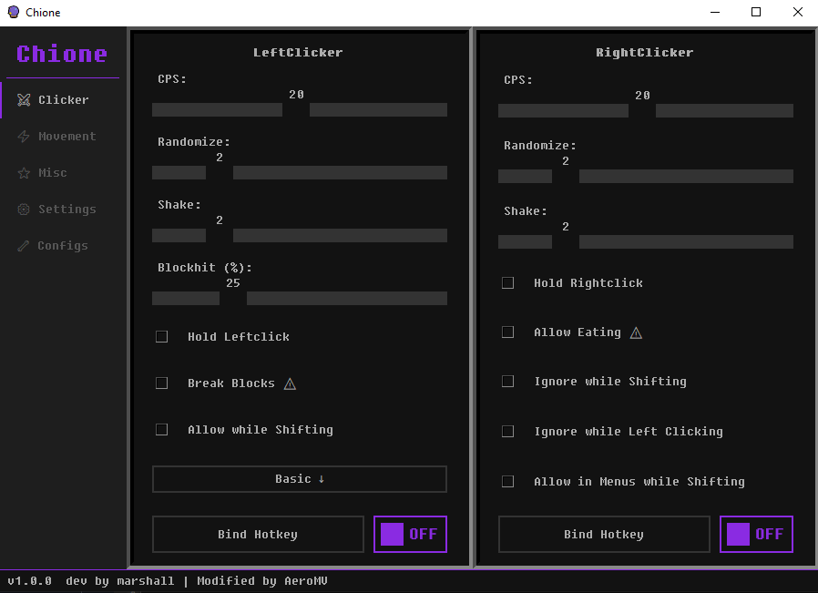
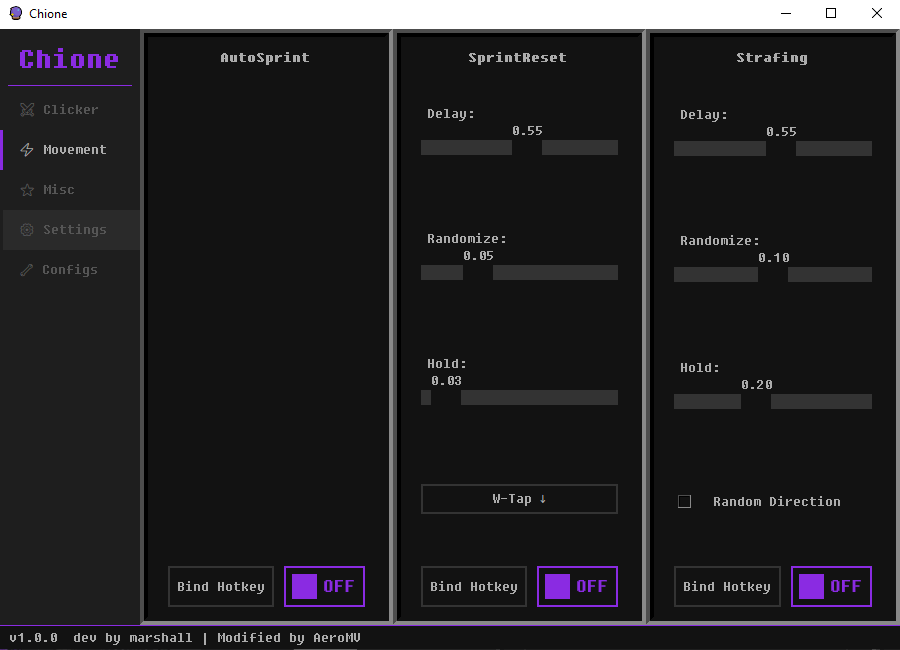

<h1 align="center">🔮 Chione v1.0.0</h1>
<p align="center">Modified & upgraded fork of the original <a href="https://github.com/LennardFe/Chione">Chione v0.1.8</a> by marshall.</p>
<p align="center">External autoclicker + movement tool for Minecraft 1.7/1.8 PvP.</p>

---

<h2 align="center">What changed from v0.1.8</h2>

### Combat

- **CPS is now locked** — set 13, get 13. No more random spikes to 14 or drops to 12.
- **Right Clicker got filters:**
  - `Ignore while Shifting` — stops right clicking when you crouch.
  - `Ignore while Left Clicking` — pauses right click while you're attacking.
  - `Allow in Menus while Shifting` — shift-click in chests and inventories for fast looting.
- **Block breaking fixed on Lunar, Badlion and other launchers** — was completely broken before.

### Movement

- **AutoSprint fixed** — no longer randomly switches to walking.
- **SprintReset** — W-Tap, S-Tap, or Crouch modes. Only triggers during actual fights, stays off when running around.
- **Strafing improved** — faster A/D switching during fights, doesn't interfere when you steer manually.

### Hotkeys

- **Works on any keyboard layout** — Arabic, French, AZERTY, doesn't matter.
- **Hotkeys no longer randomly stop working** after switching windows.

### Stability

- **Window focus detection rebuilt** — no more random freezes after alt-tabbing.
- **Left clicker doesn't "forget" it's active anymore** — there was a bug where clicking would silently stop.
- **Config auto-repair** — corrupted settings file won't crash the app, it auto-resets.

### Defaults

| Setting | Default |
| :--- | :--- |
| CPS | `13` |
| Randomize | `0` |
| Shake | `0` |
| Hold Leftclick | `ON` |
| Allow while Shifting | `ON` |

---

<h2 align="center">Screenshots</h2>

<p align="center">
  
  
</p>

---

<h2 align="center">Installation</h2>

<h3 align="center">For Users:</h3>

<div align="center">
<p><b>Just want to use it? Download the .exe from the <a href="https://github.com/AeroMV/Chione/releases">Releases</a> page.</b></p>
</div>

<div align="justify">
<p>Your antivirus might flag the exe — that's normal for compiled Python apps. The source code is fully open, check it yourself.</p>
</div>

<h3 align="center">For Developers:</h3>

<div align="justify">
<p>Install Python 3.11+, clone the repo, and set up a virtual environment:</p>
</div>

```
python -m venv .venv
.venv\Scripts\Activate
pip install -r requirements.txt
```

<div align="justify">
<p>Then just run:</p>
</div>

```
python main.py
```

### Build EXE

```
pyinstaller Chione.spec
```

Output goes to `dist/`.

---

<h2 align="center">Additional Information</h2>

<div align="justify">
<p>Usage of autoclickers may be prohibited by some servers. I do not take any responsibility for consequences resulting from using this tool. Use it at your own risk. For more information, refer to the <a href="LICENSE.md">LICENSE</a>.</p>
</div>

<div align="center">
<p>Modified by <b>AeroMV</b> · Original by <b>marshall</b></p>
</div>
